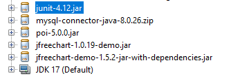

#Tips for use this repository

1. when you try to use this project is probably that don't work for dependancies. 

- This is the most important :

    
- The dependencies are on the dependencies folder

- Use an IDE that can read binaries or download the HexEditor in vscode.